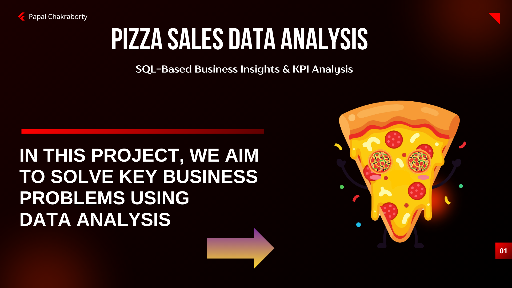

# Pizza Sales Data Analysis (SQL Project)

##  Description
This project analyzes pizza sales data using SQL to extract key business insights, identify customer behavior patterns, and evaluate product performance. The goal is to support data-driven business decisions through structured query analysis.

##  Tools Used
- Microsoft SQL Server
- SQL Server Management Studio (SSMS)

##  Key Performance Indicators (KPIs)
- Total Revenue
- Average Order Value (AOV)
- Total Orders
- Total Pizzas Sold
- Average Pizzas per Order

##  Analysis Performed
- Daily Order Trends
- Hourly Order Trends
- Sales by Pizza Category
- Sales by Pizza Size
- Top 5 Best-Selling Pizzas
- Bottom 5 Least-Selling Pizzas
- Top 5 Highest Value Orders

##  Project Insights

### KPI Overview

### Daily Order Trend

### Hourly Order Trend

### Sales by Category

### Sales by Size

### Top & Bottom Performing Pizzas

##  Key Insights
- The Average Order Value (AOV) is 38.31, indicating moderate customer spending per order.
- Order volume peaks on Thursday, Friday, and Saturday, showing higher demand toward the weekend.
- Peak ordering hours are 12 PM, 1 PM, 5 PM, 6 PM, and 7 PM.
- Classic and Supreme categories contribute the highest share of revenue.
- Large and Medium pizza sizes are the most preferred.
- The Classic Deluxe Pizza is the top-selling product based on quantity.
- The Brie Carre Pizza shows the lowest demand among all products.

##  Business Recommendations
- Increase staffing and inventory during peak days and hours.
- Introduce combo deals and upselling strategies to improve AOV.
- Launch targeted promotions during high-demand periods (Thu–Sat).
- Expand delivery capacity during peak hours.
- Focus marketing efforts on high-performing categories and sizes.
- Re-evaluate or remove low-performing products from the menu.

##  Reports
- Problem Statement: Defines business objectives and KPIs
- Final Report: Contains SQL queries, results, insights, and recommendations

##  Project Structure
- Data
- Sql
- Reports
- Images
    
##  Conclusion
This project demonstrates how SQL can be used to transform raw data into meaningful business insights, helping organizations make informed decisions and improve overall performance.

